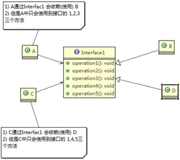
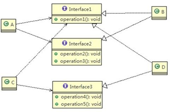

# design-pattern
<<<<<<< HEAD
# 设计模式

> &emsp;设计模式是对软件设计中普遍存在（反复出现）的各种问题，所提出的解决方案。

## Ⅰ、前置概念

> 什么是设计模式

&emsp;是一套被反复使用、多数人知晓的、经过分类编目的、代码设计经验的总结。设计模式的本质是面向对象设计原则的实际运用，是对类的封装性、继承性和多态性以及类的关联关系和组合关系的充分理解。

* **创建型模式**

  **用于描述“怎样创建对象”，它的主要特点是“将对象的创建与使用分离”**。GoF（四人组）书中提供了单例、原型、工厂方法、抽象工厂、建造者等 5 种创建型模式。（好比买盖房所需要的材料，钢筋水泥等）

* **结构型模式**

  **用于描述如何将类或对象按某种布局组成更大的结构**。GoF（四人组）书中提供了代理、适配器、桥接、装饰、外观、享元、组合等 7 种结构型模式。（好比用这些材料搭建成整个房屋的架构）

* **行为型模式**

  **用于描述类或对象之间怎样相互协作共同完成单个对象无法单独完成的任务，以及怎样分配职责。**GoF（四人组）书中提供了模板方法、策略、命令、职责链、状态、观察者、中介者、迭代器、访问者、备忘录、解释器等 11 种行为型模式。

> UML（统一建模语言），其中类图为主要学习内容

&emsp;类图(Class diagram)是显示了模型的静态结构，特别是模型中存在的类、类的内部结构以及它们与其他类的关系等。类图不显示暂时性的信息。类图是面向对象建模的主要组成部分，是系统分析和设计阶段的重要产物。

&emsp;**（类的表示）**在UML类图中，类使用包含类名、属性(field) 和方法(method) 且带有分割线的矩形来表示，属性/方法名称前加的加号和减号表示了这个属性/方法的可见性，UML类图中表示可见性的符号有三种：

* +：表示public
* -：表示private
* #：表示protected


&emsp;属性的完整表示方式是： **可见性  名称 ：类型 [ = 缺省值]**  

&emsp;方法的完整表示方式是： **可见性  名称(参数列表) [ ： 返回类型]**

&emsp;**（类与类之间关系）**，包括关联、聚合、组合、依赖、继承、实现

- 关联关系是对象之间的

> 软件设计原则

## 一、创建型设计模式（5种）

> &emsp;创建者模式的主要关注点是“怎样创建对象？”，它的主要特点是“**将对象的创建与使用分离**”。这样可以降低系统的耦合度，使用者不需要关注对象的创建细节。

### 1、单例模式

> &emsp;这个模式涉及到一个单一的类，该类负责创建自己的对象，同时确保只有单个对象被创建。这个类提供了一种访问其唯一对象的方式，可以直接访问，不需要实例化该类的对象。主要包含以下角色：
>
> - 单例类。只能创建一个实例的类
> - 访问类。使用单例类（比如测试类）

&emsp;单例模式分类两种：

- 饿汉式：类加载就会导致该单实例对象被创建。如果该对象足够大的话，而一直没有使用就会造成内存浪费。
  - 静态变量方式
  - 静态代码块方式
- 懒汉式：类加载不会导致该单实例对象被创建，而是首次使用该对象时才会创建


2、原型模式

3、工厂方法模式

4、抽象工厂模式

### 5、建造者模式

> &emsp;将一个复杂对象的构建与表示分离，使得同样的构建过程可以创建不同的表示。

复杂对象的构建：构成主机的各个部件

复杂对象的表示：主机本身


## 结构型模式（7种）

1、代理模式

2、适配器模式

3、桥接模式

4、装饰者模式

5、外观模式

6、享元模式

7、组合模式

## 行为型模式（11种）

1、模板方法模式

2、策略模式

3、命令模式

4、责任链模式

5、状态模式

6、观察者模式

7、中介者模式

8、迭代器模式

9、访问者模式

10、备忘录模式

11、解释器模式

## 一、设计模式遵从的原则

#### 1、单一职责原则

> 对类来说的，即一个类应该只负责一项职责。

```
  如类A负责两个不同的职责：职责1，职责2。当职责1需求改变而改变A时，可能造成职责2执行错误，所以需要将A的粒度分解为A1，A2。
  通常情况下，我们应当遵守单一职责原则，只有逻辑足够简单，才可以在代码级违反单一职责；只有类中方法数量足够少，可以在方法级别保持单一职责原则。
```


#### 2、接口隔离原则

> 客户端不应该依赖它不需要的接口，即一个类对另一个类的依赖应该建立在最小的接口上。



```
	类A 通过 接口Interface1 依赖 类B，类C 通过 接口Interface1 依赖 类D，如果 接口Interface1 对于 类A 和 类C 来说不是最小接口，那么 类B 和 类D 必须去实现他们不需要的方法。

按隔离原则应当这样处理：
	将 接口Interface1 拆分为独立的几个接口(这里我们拆分成 3 个接口)，类 A 和类 C 分别与他们需要的接口建立依赖关系。也就是采用接口隔离原则
```

 

#### 3、依赖倒转原则

> 1. 高层模块不应该依赖低层模块，二者都应该依赖其抽象
> 2. 抽象不应该依赖细节，细节应该依赖抽象
> 3. 依赖倒转(倒置)的中心思想是面向接口编程
> 4. 依赖倒转原则是基于这样的设计理念：相对于细节的多变性，抽象的东西要稳定的多。以抽象为基础搭建的架构比以细节为基础的架构要稳定的多。在 java 中，抽象指的是接口或抽象类，细节就是具体的实现类
> 5. 使用接口或抽象类的目的是制定好规范，而不涉及任何具体的操作，把展现细节的任务交给他们的实现类去完成
> 6. 实现方式：
>    1. 通过接口传递方式
>    2. 通过构造方法传递方式
>    3. 通过setter方法传递方式

```
1)	低层模块尽量都要有抽象类或接口，或者两者都有，程序稳定性更好.
2)	变量的声明类型尽量是抽象类或接口, 这样我们的变量引用和实际对象间，就存在一个缓冲层，利于程序扩展和优化
3)	继承时遵循里氏替换原则

```


1. 里式替换原则
2. 开闭原则OCP
3. 迪米特法则
4. 合成复用原则


UML类图


状态模式


解释器设计模式


# 

# 一、单例模式

### 1、饿汉式（静态常量）

> 所谓饿汉，类很饿，饥不择食，一上来就被创建了一个对象实例

步骤如下：

> 1. 构造器私有化（防止外部new）
> 2. 类的内部创建对象，final static变量修饰
> 3. 向外暴露一个静态的公共方法，以便外部获取对象。

优缺点说明：

> 1. 优点：写法简单，在类装载的时候就完成实例化，避免了线程同步问题。
> 2. 缺点：在类装载的时候就完成实例化，没有达到"懒加载"的效果。如果从始至终从未使用过这个实例，则会造成内存的浪费。导致了
>
> &emsp;注意类加载时机：new一个对象、访问类的静态成员、调用类的静态方法、给类的静态成员赋值、程序的主类、反射

### 2、饿汉式（静态代码块）

优缺点说明：

> 1. 这种方式和上面的方式其实类似，只不过将类实例化的过程放在了静态代码块中，也是在类加载的时候，就执行静态代码块中的代码，初始化类的实例。优缺点和上面是一样的。

### 3、懒汉式（线程不安全）

> 所谓懒汉，只有使用者主动去获取，它才会给你创建

优缺点说明：

> 1. 起到了"类加载"的效果，但是只能在单线程下使用。
> 2. 如果在多线程下，一个线程进入了`if(singleton==null)`判断语句块，还未来得及往下执行，另一个线程也通过了这个判断语句，这时便会产生多个实例。所以在多线程环境下不可使用这种方式。
> 3. 实际开发中不能用这种方式。

### 4、懒汉式（线程安全，同步方法）

> &emsp;直接在获取实例的方法上面加`synchronized`，同步处理的代码
>
> 提供一个静态的公有方法，加入同步处理的代码，解决了线程安全问题

优缺点说明：

1. 解决了线程不安全问题。
2. 效率太低了，每个线程在想获得类的实例时候，执行`getInstance()`方法都要进行同步。而其实这个方法只执行一次实例化代码就够了，后面的想获得该实例，直接return就行了。方法进行同步效率太低，锁粒度过大。

### 5、懒汉式（线程安全，同步代码块）

> &emsp;前面的锁粒度太大，干脆在创建实例的时候再去进行同步。但是不能满足线程安全的
>
> 这里由于JVM存在指令重排，可能会造成第一个线程还没初始化完毕，仅仅得到地址，第二个线程获得了这个instance，建议先学JVM

在Java中单例关键字的作用

### 6、双重检查

volatile关键字在这里的作用是：防止指令重排序，可见性

new 操作中初始化内存空间和指向内存空间这两步操作会根据情况不同，执行顺序不同，如果先是指向内存空间执行，这时对象不为空，另一个线程有可能进入并返回未初始化的对象。

实例化代码只用执行一次，后面访问时，判断`if(singleton==null)`直接return实例化对象，也避免方法进行方法同步

所以，在同步代码块中，

### 7、静态内部类

静态内部类的特点：

> 1. 

线程安全由虚拟机保证

优缺点说明：

1. 这种方式采用了类装载的机制来保证初始化实例时只有一个线程。
2. 静态内部类方式再Singleton类被装载是并不会立即实例化，而是在需要实例化时，调用getInstance方法，才会装载SingletonInstance类，从而完成Singleton的实例化。
3. 类的静态属性只会在第一次加载类的时候初始化，所以在这里，JVM帮助我们保证了线程的安全性，在类进行初始化时，别的线程是无法进入的。
4. 优点：避免了线程不安全，利用静态内部类特点实现延迟加载，效率高

### 枚举

优缺点说明：

1. 不仅能避免多线程同步问题，而且还能防止反序列化创建新的对象。时 b


JDK中用到的单例模式

Runtime是饿汉式的方式实现的‘

 


# 二、工厂模式


传统方式：

优缺点：违反开闭原则，即对扩展开放，对修改关闭

### 简单工厂模式：

普通简单工厂

多方法简单工厂

静态方法简单工厂


**基本介绍**

> 1. 简单工厂模式是属于**创建型模式**，是工厂模式的一种。简单工厂模式是由一个工厂对象决定创建出哪一种产品类的实例。简单工厂模式是工厂模式家族中最简单实用的模式
> 2. 简单工厂模式：**定义了一个创建对象的类，由这个类来封装实例化对象的行为(代码)**
> 3. 在软件开发中，当我们会用到大量的创建某种、某类或者某批对象时，就会使用到工厂模式.

也可叫静态工厂模式


### 工厂方法模式

基本介绍：将披萨项目的实例化功能抽象成抽象方法，在不同的口味点餐子类中具体实现。

工厂方法模式：定义了一个创建对象的抽象方法，由子类决定要实例化的类。工厂方法模式将对象的实例化推迟到子类。


### 抽象工厂模式

基本介绍：


# 三、原型模式

基本介绍：

> 1. 用原型实例指定创建对象的种类，并且通过拷贝这些原型，创建新对象。
> 2. 原型模式是一种创建型设计模式，允许一个对象再创建另外一个可定制的对象，无需知道如何创建的细节。
> 3. 工作原理是：通过将一个原型对象传给那个要发动创建的对象，这个要发动创建的对象通过请求原型对象拷贝它们自己来实施创建，即`对象.clone()`。


# 装饰者模式


=======
Java设计模式
>>>>>>> f710a2256ebb38e356460c3cc76219e14f30729d
